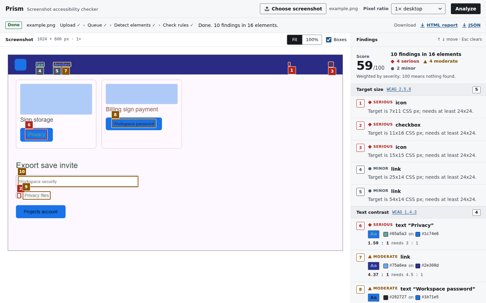
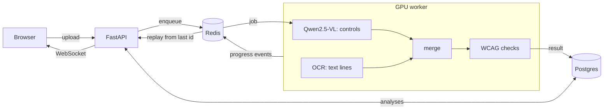
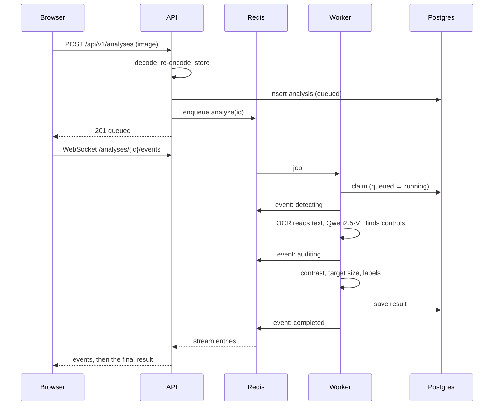

# Prism

Prism audits UI screenshots for accessibility problems. Upload a screenshot and
it reports low text contrast, touch targets smaller than 24 CSS px, and form
controls without a visible label, each tied to a WCAG 2.2 success criterion.

A vision-language model (Qwen2.5-VL-3B, 4-bit) finds and classifies the
controls, and an OCR model finds the text. The checks themselves are ordinary
code that measures pixels. A 3B model can't compute a contrast ratio reliably;
a function can, and it can be unit-tested.



## Architecture



- **API** (`src/prism/api`): upload, results, reports, cancel. Each browser gets
  an anonymous workspace through an HMAC-signed cookie, so visitors can't read
  each other's analyses.
- **Worker** (`src/prism/worker`): one job at a time on one GPU. Inference runs
  in a thread; cancelling flips a flag the model checks on every token.
- **Detection** (`src/prism/vision`): Qwen2.5-VL finds buttons, links, inputs,
  checkboxes, icons and images; OCR (PP-OCR on the CPU) finds the text; the
  two are merged so a button's caption isn't also listed as loose text.
- **Events** (`src/prism/events.py`): progress goes into a Redis stream per
  analysis. A browser that connects late or reconnects replays what it missed.
- **Checks** (`src/prism/a11y`): contrast (SC 1.4.3), target size (SC 2.5.8),
  visible labels (SC 3.3.2).

### Lifecycle of an analysis



## Results

Measured on synthetic pages with exact ground truth, rendered in Chromium and
labelled from the DOM. Rules were tuned on one seed and reported on another.
Full tables and method: [eval/README.md](eval/README.md).

**Checks on correct boxes** (300 pages):

| Check | Precision | Recall |
|---|---|---|
| Text contrast | 0.87 | 0.93 |
| Target size | 1.00 | 1.00 |
| Visible label | 1.00 | 0.75 |

**End to end with the detector** (4-bit NF4, 60 pages, RTX 4060 Laptop):

| | 3B, prompt v1 | 3B, prompt v2 | 3B, v4 + OCR (default) | 7B at 1280 px, v4 + OCR |
|---|---|---|---|---|
| Element boxes found (F1) | 0.63 | 0.64 | 0.76 | 0.79 |
| Boxes with correct type (F1) | 0.27 | 0.45 | 0.50 | 0.59 |
| Target-size findings (F1) | 0.19 | 0.71 | 0.69 | 0.62 |
| Contrast findings (F1) | 0.73 | 0.68 | 0.80 | 0.82 |
| Visible-label findings (F1) | 0.19 | 0.19 | 0.34 | 0.36 |
| Time per page | | 25 s | 22 s | 15 s |
| Peak VRAM | 2.6 GB | 2.6 GB | 2.6 GB | 6.8 GB |

Boxes were good from the start (mean IoU about 0.8), but the first prompt
labelled most links and buttons as plain text, which switched off the
target-size check. Scoring boxes and labels separately exposed it, and
defining each label in the prompt fixed most of it. The next gap was small
text: the model missed more than half of it, while an OCR model finds 247 of
248. So text now comes from OCR, and the VLM is only asked for controls
(prompt v4). That lifted contrast from 0.68 to 0.80 and the label check from
0.19 to 0.34.

These choices were made on the first 60 test pages, then re-checked on 240
pages none of them had seen, with bootstrap confidence intervals. The label
check gain from v4 held (0.28 to 0.41 against v2, interval +0.05 to +0.20),
at a small, real cost in contrast (0.82 to 0.79).

Generation is about 90% of the time, so writing fewer tokens is what makes it
faster. 7B decodes faster per token than 3B on this laptop (the GPU sits
partly idle with the smaller model), and with v4 it writes 43% fewer tokens,
so on an 8 GB GPU it is the fastest setup and the best at finding and
classifying elements. 3B stays the default because it fits in 4 GB.

## Project layout

```
src/prism/
  api/          FastAPI app, routes, uploads, workspaces, rate limit
  worker/       arq worker and the analyze task
  vision/       Qwen2.5-VL backend, OCR, merging, output parser
  a11y/         contrast, target size, label checks and scoring
  db/           SQLAlchemy models and Alembic migrations
  evaluation/   synthetic data generator, metrics, benchmark CLI
  events.py     Redis Streams progress events
  report.py     HTML report with the annotated screenshot
web/            the page: plain HTML, CSS and JS, built with Vite
tests/          unit, integration (Postgres + Redis), model smoke tests
eval/           benchmark write-up and result files
deploy/         Dockerfiles and Compose files
docs/           design decisions
```

## Running locally

Requires Python 3.12+, [uv](https://docs.astral.sh/uv/), Node 22+, Postgres and
Redis. The worker needs an NVIDIA GPU (developed on an 8 GB RTX 4060).

```bash
cp .env.example .env   # set PRISM_SECRET_KEY and the database URL
make install migrate
make api               # http://127.0.0.1:8000/docs
make worker            # downloads the model on first run
make web               # http://localhost:5173
```

On Windows, PyPI only has CPU builds of PyTorch. After syncing the worker
extra, swap in the CUDA build and run the worker without re-syncing:

```powershell
uv sync --extra worker
uv pip install --reinstall torch torchvision --index-url https://download.pytorch.org/whl/cu128
uv run --no-sync prism-worker
```

With Docker (set `POSTGRES_PASSWORD` and `PRISM_SECRET_KEY` in `.env` first):

```bash
make up                # Postgres, Redis, API and web on http://127.0.0.1:8000
make up-gpu            # the same plus the GPU worker
```

## Tests

```bash
make test        # unit + integration; needs Postgres and Redis
make test-web
make lint typecheck
```

Integration tests use a throwaway database (`PRISM_TEST_DATABASE_URL`) and
Redis db 15. Tests marked `model` run the real detector code on a tiny random
checkpoint, so they need the `worker` extra but no GPU.

## Limitations

- Everything comes from pixels. No DOM means no alt text, focus order, ARIA
  or keyboard checks.
- Large text for contrast is guessed from box height; bold 14 pt text counts
  as normal text.
- The label check works from layout, so a heading directly above an unlabeled
  input reads as its label.
- The visible-label check is still the weakest (F1 0.34 on 3B, 0.36 on 7B).
  Text is no longer the problem: the models miss about half of the
  unlabeled inputs and checkboxes, and sometimes call an empty image
  placeholder an input.
- Detection has only been measured on synthetic pages so far.

More on the trade-offs: [docs/decisions.md](docs/decisions.md).
