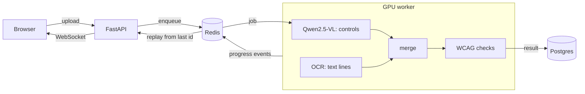

# Prism

Prism checks a UI screenshot for three common accessibility problems: text
with too little contrast, tap targets smaller than 24 px, and form fields with
no visible label. Upload a screenshot and it marks each problem on the image,
with the WCAG 2.2 rule it breaks.


## Why I built this

Accessibility checkers like axe and Lighthouse read a page's code. That works
when you have the code, but a lot of design review happens on pictures: a
Figma export, a screenshot pasted into a bug report, a phone app you can't
inspect. I wanted to see how much of an accessibility check you can do from
pixels alone.

The obvious approach is to show a vision-language model the screenshot and
ask what's wrong. I tried that first, and the answers sound right and can't
be checked: a contrast ratio is arithmetic, and a 3B model guessing it is
just guessing. So Prism splits the work. The model only finds the elements;
plain code does the measuring, and every number it reports can be traced
back to pixels. I also wanted to know how often it's right, so the repo
includes a benchmark with exact ground truth.

## What it does

- Finds buttons, links, inputs, checkboxes, icons and images with
  Qwen2.5-VL, and text with an OCR model.
- Checks text contrast (WCAG 1.4.3) from the actual pixel colours, target size
  (2.5.8) in CSS pixels using the screenshot's pixel ratio, and visible
  labels (3.3.2) from layout.
- Shows progress live (queued, detecting, checking) and can cancel a running
  job.
- Gives a score, findings grouped by rule, the measured colours for each
  contrast problem, and HTML or JSON reports to download.
- Keeps each visitor's analyses private without accounts, using a signed
  cookie.

## How it works



The API stores the upload and queues a job. A worker with the model loaded
runs one job at a time: the VLM finds controls, OCR finds text, the two lists
are merged, and the checks run on the result. Progress goes into a Redis
stream, so a browser that connects late or reconnects replays what it missed.

## Results

Measured on generated web pages with exact ground truth (rendered in
Chromium, labelled from the DOM). F1 scores:

| Check | On correct boxes | Full pipeline |
|---|---|---|
| Text contrast | 0.90 | 0.80 |
| Target size | 1.00 | 0.68 |
| Visible label | 0.86 | 0.41 |

The first column is the checks alone, given the true element boxes (300 test
pages). The second is the whole pipeline, model errors included, on 240 pages
that no prompt or model choice was tuned on. The default setup (Qwen2.5-VL-3B in
4-bit, 896 px) needs 2.6 GB of VRAM and takes about 22 s per page on an RTX
4060 laptop GPU. The 7B model at 1280 px is faster there (15 s) and better at
finding elements, but needs 6.8 GB.

Each step was driven by a measured gap. Scoring boxes and labels separately
showed the first prompt called most buttons and links "text", so the second
prompt defined each label (target size 0.19 to 0.71). Per-kind scores showed
the model missed most small text, so text now comes from OCR (contrast 0.68
to 0.80). Asking the model for controls only then fixed input boxes (label
check 0.28 to 0.41, with a confidence interval of +0.05 to +0.20).

The full write-up, with every run, the held-out comparisons and the timing
analysis: [eval/README.md](eval/README.md).

## Tech stack

- **API:** Python 3.12, FastAPI, SQLAlchemy 2 (async) with Postgres, Alembic,
  arq on Redis, WebSockets.
- **Model:** Qwen2.5-VL (Transformers, bitsandbytes 4-bit), PP-OCR through
  rapidocr on ONNX Runtime.
- **Checks:** NumPy and Pillow.
- **Frontend:** plain HTML, CSS and JavaScript, built with Vite. No framework.
- **Tooling:** uv, ruff, mypy (strict), pytest, Vitest, Playwright (for the
  benchmark), Docker Compose, GitHub Actions.

## Quick start

You need Docker, or Python 3.12+ with [uv](https://docs.astral.sh/uv/),
Node 22+, Postgres and Redis. The worker needs an NVIDIA GPU.

**With Docker:**

```bash
cp .env.example .env    # set POSTGRES_PASSWORD and PRISM_SECRET_KEY
make up-gpu             # Postgres, Redis, API, web and the GPU worker
```

Open http://127.0.0.1:8000. `make up` starts everything except the worker,
which is enough to look at the page, but analyses will wait in the queue.

**Locally:**

```bash
docker run -d -p 5432:5432 -e POSTGRES_USER=prism -e POSTGRES_PASSWORD=prism-test \
    -e POSTGRES_DB=prism postgres:16
docker run -d -p 6379:6379 redis:7
cp .env.example .env    # set PRISM_SECRET_KEY, and prism-test as the database password
make install migrate
make api                # http://127.0.0.1:8000/docs
make worker             # downloads the model on first run
make web                # http://localhost:5173
```

On Windows, PyPI only has CPU builds of PyTorch. After `uv sync --extra
worker`, install the CUDA build and start the worker without re-syncing:

```powershell
uv pip install --reinstall torch torchvision --index-url https://download.pytorch.org/whl/cu128
uv run --no-sync prism-worker
```

To use the 7B model: `PRISM_DETECTOR_MODEL=Qwen/Qwen2.5-VL-7B-Instruct
PRISM_DETECTOR_MAX_SIDE=1280 make worker`.

**Tests:**

```bash
make test        # unit and integration tests (needs Postgres and Redis)
make test-web
make lint typecheck
```

Integration tests use a separate database (create `prism_test` in the
Postgres above) and Redis db 15. Tests marked `model` run the real detector
code on a tiny random checkpoint, so they need the `worker` extra but no GPU.

## Design notes

- **The model's output is data, not instructions.** Text in a screenshot can
  say anything, including instructions to the model. Output is parsed
  tolerantly (code fences, truncated arrays), validated with Pydantic, and
  only ever rendered as text.
- **Contrast from pixels.** The pixels in a text box are split into two
  clusters; the larger is the background. The text colour comes from the 20%
  of text pixels furthest from the background, because anti-aliased edges
  blend the two. Seeding the clustering with the darkest and lightest pixels
  failed on small buttons, where the rounded corners got picked as text; the
  benchmark caught it, and seeding with the most common colour raised recall
  from 0.77 to 0.93.
- **Redis Streams, not pub/sub.** The browser opens its WebSocket after the
  upload returns, and a fast job could finish first. A stream per analysis
  keeps the events, so nothing is lost. Closing the page doesn't cancel the
  job; cancelling is an explicit request.
- **Cancelling mid-generation.** `generate()` runs in a thread. A task polls
  a Redis key and sets a flag that a stopping criterion checks on every
  token, so the model loop never waits on the network. A job that times out
  is marked failed and its thread stopped the same way.
- **One job per GPU.** Two generations on an 8 GB card either run out of
  memory or run at half speed each, so the worker takes one job at a time.
  Scaling out means more workers, each with its own GPU.
- **Uploads are re-encoded.** Files are decoded by Pillow, size-checked
  before decoding, and written back out under a random name, which drops EXIF
  and anything appended to the image. Request bodies over the limit are
  refused before they are read.

## Limitations

- Everything comes from pixels: no alt text, focus order, ARIA or keyboard
  checks.
- Large text is guessed from box height, so bold 14 pt text counts as normal
  text.
- The label check is the weakest (0.41). The models miss about half the
  unlabeled inputs and checkboxes, and a heading directly above an input reads
  as its label.
- The benchmark pages are synthetic. Detection hasn't been measured on real
  screenshots yet.

## Project layout

```
src/prism/
  api/          FastAPI app, routes, uploads, workspaces, rate limit
  worker/       arq worker and the analyze task
  vision/       Qwen2.5-VL backend, OCR, merging, output parser
  a11y/         contrast, target size and label checks, scoring
  db/           SQLAlchemy models and Alembic migrations
  evaluation/   synthetic pages, metrics, benchmark CLI (prism-eval)
web/            the page
tests/          unit, integration and model tests
eval/           benchmark write-up and result files
deploy/         Dockerfiles and Compose files
```
